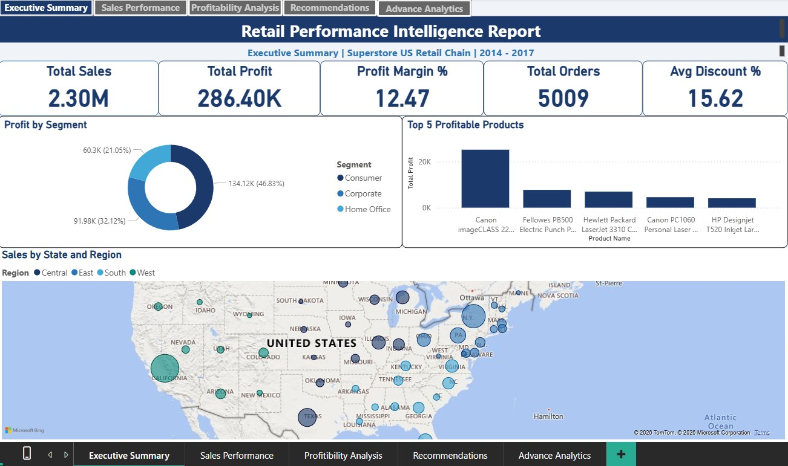

# Retail Performance Intelligence Report

## Overview
A comprehensive 5-page Power BI report analyzing 4 years of sales data 
(2014-2017) for a US retail Superstore chain. The report identifies 
profitability gaps, geographic performance variations, and provides 
data-driven strategic recommendations backed by statistical analysis.

## Business Problem
Sales have grown consistently year over year, but profit margins have 
remained flat — indicating profitability issues that aren't visible 
from revenue alone. This report identifies the root causes and 
quantifies recommended actions.

---

## Report Pages

### 1. Executive Summary

High-level KPIs including Total Sales (2.30M), Total Profit (286.40K), 
Profit Margin % (12.47%), Total Orders (5,009), and Average Discount % 
(15.62%). Includes a geographic sales map and segment-wise profit breakdown.

### 2. Sales Performance Analysis

Regional and category-wise sales analysis with cascading Region/State/City 
slicers, dual-axis Sales & Profit Margin trend, drill-down matrix by 
Category → Sub-Category → Product, and a sales forecast through 2021.

### 3. Profitability Analysis

Deep-dive into profitability drivers — Discount % vs Profit Margin % 
comparison by Sub-Category, Profit vs Sales scatter plot with discount-based 
bubble sizing, Top 5 Profitable States, and Segment-wise margin comparison.

### 4. Strategic Recommendations

6 data-backed recommendations including a Discount Cap Policy 
(estimated $17,725+ annual profit recovery), regional pricing audits, 
and segment-specific strategies.

### 5. Advanced Analytics (Python Integration)

Statistical analysis using Python (matplotlib, seaborn) embedded directly 
in Power BI — including a Profit Distribution Box Plot by Category and a 
Correlation Heatmap proving a -0.26 correlation between Discount and Profit 
across all 9,994 orders.

---

## Key Findings
- Tables and Bookcases sub-categories operate at -24% profit margins due 
  to 75%+ discount rates
- 1,318 out of 5,009 orders (26.31%) are loss-making
- Discount shows a statistically significant -0.26 correlation with Profit
- Home Office segment has the highest profit margin (14%) despite lower volume
- Sales forecast shows continued growth through 2021

## Tools Used
- Power BI Desktop
- DAX (CALCULATE, TOTALYTD, SAMEPERIODLASTYEAR, DISTINCTCOUNT)
- Python (matplotlib, seaborn) integrated visuals
- Power Query (ETL and data cleaning)

## Dataset
Superstore Sales Dataset — 9,994 orders, 21 columns, 2014-2017
